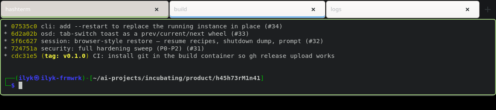
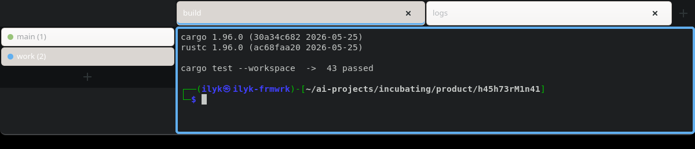
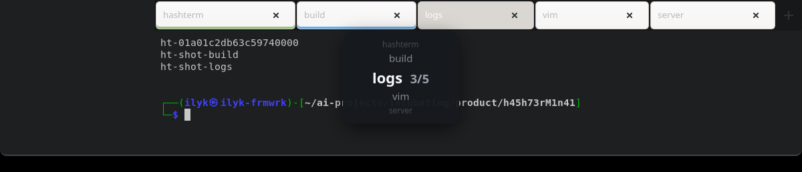

# hashterm

A tmux-native quake terminal for Linux with a two-dimensional tab matrix and
browser-style session resurrection.

Every tab is a session on a **dedicated private tmux server** — the GUI only
attaches. Kill the window, crash it, `kill -9` it: your shells, scrollback and
running programs keep going, and the next launch re-adopts them exactly where
they were.



## Features

- **Quake-style drop-down** — a global hotkey (default `F12`) slides the
  frameless console from the screen edge and keeps it above all other windows.
  X11 (EWMH), wlroots/KDE (layer-shell) and GNOME Wayland (via XWayland, like
  tilda/guake) are all handled; hotkeys go through the desktop portal with
  XGrabKey fallback.
- **Tab matrix** — tabs are organized in two dimensions: *groups* (rows) on
  one window edge, the active group's *terminals* (columns) on the
  perpendicular edge. `Ctrl+PgUp/PgDn` moves between groups, `Ctrl+Home/End`
  between terminals. Groups get colors, drawn as nested accent rings around
  the terminal (outer = group, inner = per-tab accent). Drag a tab onto
  another to reorder, onto a group row to move it there, onto the group bar's
  `+` for a brand-new group.
- **Session resurrection, browser-style** — full dumps capture layout,
  working directories, scrollback and the foreground program of every pane.
  Restores relaunch safe-listed programs (`vim -S` sessions included), and
  pre-type everything else at the prompt so a single `Enter` re-runs it.
  Autosaves rotate on a timer and on exit; named saves never expire.
  `sudo`/`ssh-add`-class commands are never replayed.
- **Config as a file, not a dialog** — `~/.config/hashterm/config.toml`,
  fully commented, live-reloaded on save. Hotkey conflicts are detected and
  surfaced on-screen instead of silently picking a winner.
- **Small touches** — per-tab names and accent colors, switch OSD toasts,
  auto-hiding tab bar on any edge, separate terminal/tab-bar/window opacity,
  `Ctrl+Alt+Shift`+scroll live window transparency (remembered across
  restarts), clipboard bridged into tmux copy-mode.

### The tab matrix

Groups run along one edge, the active group's terminals along the perpendicular
one. Each group has a color, drawn as a ring around the terminal; drop a tab on
a group to move it, or on `+` for a new one.



### The switch dial

Switching tabs shows a wheel: the current tab bright in the center, neighbors
receding above and below.



## Install

On Debian-family systems, build the package and install it:

```sh
cargo build --release
./packaging/build-deb.sh
sudo apt install ./dist/hashterm_*.deb
```

Runtime dependencies: GTK 4 (≥ 4.18), VTE4 (≥ 0.84), gtk4-layer-shell, tmux.

### Building from source

```sh
sudo apt install libgtk-4-dev libvte-2.91-gtk4-dev libgtk4-layer-shell-dev
cargo build --release          # needs Rust 1.90+
./target/release/hashterm
```

## Default keys

| Key | Action |
| --- | --- |
| `F12` | toggle the drop-down (global) |
| `Ctrl+Shift+T` / `Ctrl+Shift+W` | new / close tab |
| `Ctrl+Home` / `Ctrl+End` | previous / next terminal in the group |
| `Ctrl+PgUp` / `Ctrl+PgDn` | previous / next group |
| `Alt+1..0` | jump to tab 1–10 |
| `Ctrl+Shift+B` | show/hide the tab bar |
| `Ctrl+Shift+S` | session picker (save / restore) |
| `Ctrl+Shift+C` / `Ctrl+Shift+V` | copy / paste |
| `Ctrl+Alt+Shift` + scroll | window opacity |
| right-click tab / group row | properties, rename, colors, move to group |

Everything is rebindable in `[hotkeys]`.

## Architecture

```
crates/
  hashterm-core       config, persisted UI state, IPC types
  hashterm-tmux       dedicated-server controller, bundled tmux conf, hooks
  hashterm-session    dump/restore engine (zstd scrollback, /proc discovery)
  hashterm-platform   overlay backends (EWMH / layer-shell / plain), hotkeys
  hashterm-ui         GTK4 shell: window, tab bar, group bar, VTE pages
  hashterm            the binary (+ headless dump/restore subcommands)
  hashterm-ctl        tiny helper the tmux hooks call to notify the GUI
```

The tmux server runs on its own socket — `tmux -L hashterm ls` shows your
tabs from any terminal, and everything hashterm knows about a tab (title,
group, colors) lives in tmux session options, so it survives detach, restart
and dump/restore.

## License

MIT — see [LICENSE](LICENSE).
